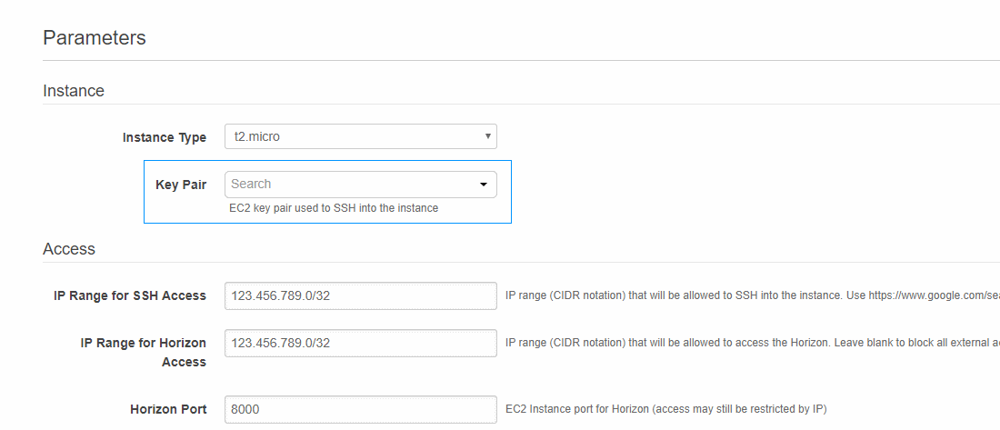

# NebulaForge: Launch Stellar infrastructure on AWS

NebulaForge enables developers looking to build a project or business on [Stellar](https://www.stellar.org/) to quickly 
deploy the necessary infrastructure in the cloud.

We plan to target a variety of use cases, from new developers looking to get started with an single-server node, 
all the way up to anchors looking to deploy highly available production infrastructure.  These "infrastructure-as-code" 
reference architectures will be built using AWS CloudFormation templates. 

This allows users to initiate a "**one-click**" deployment on their own AWS account by simply clicking on a link and 
filling out a few  parameters on a web interface. 

 
 

## Templates
- [quickstart](quickstart/) - Deploys the well-known all-in-one [stellar/quickstart](https://github.com/stellar/docker-stellar-core-horizon) docker image running in one container on a single EC2 instance. 
- [single-ec2](single-ec2/) - Deploys individual cloud-optimized docker images for [core, horizon and postgres](https://github.com/starformlabs/stellar-nebulaforge-aws/tree/master/docker-images) running in separate containers on the same EC2 instance. More inline with best practices for container deployment.
- [single-ec2-single-rds](single-ec2-single-rds/) - Similar to single-ec2, but [RDS](https://aws.amazon.com/rds/postgresql/) is used to manage the database and an [EFS](https://aws.amazon.com/efs/) backed volume is used to store [local state](https://www.stellar.org/developers/stellar-core/software/admin.html#database-and-local-state). 

## Roadmap
- Retain data after stack deletion with the ability to resume.
- RDS Aurora support.
- More complex public/private VPC setup, multi-AZ failover.
- Multiple horizon instances with load balancing.
- Multiple participation profiles - watcher, archiver, basic validator, full validator.
- Test harness for validating the infrastructure.
- Additional software - Federation server, Bridge server, Compliance server.
- Logging, Monitoring, Alerting and other best practices.
- Option to use EKS (Kubernetes) instead of ECS when it becomes available.