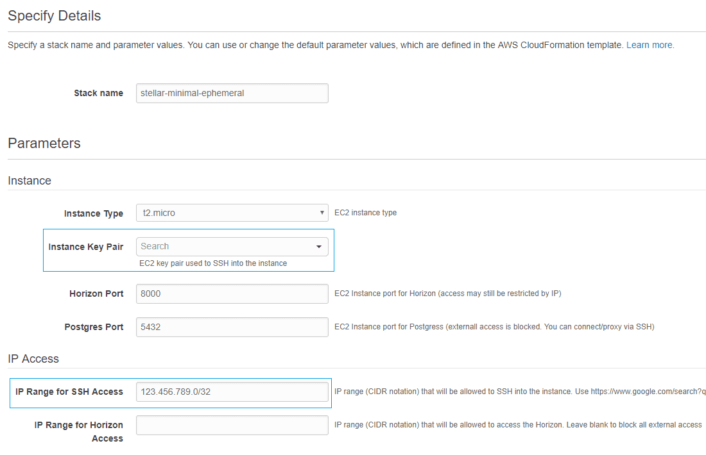
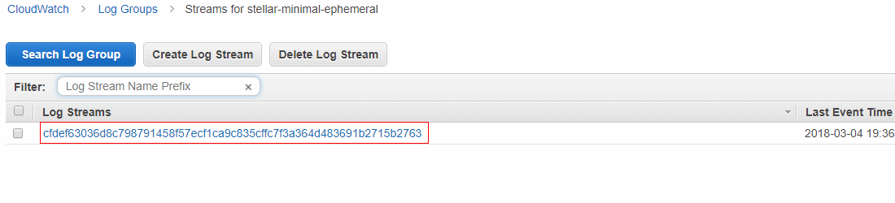
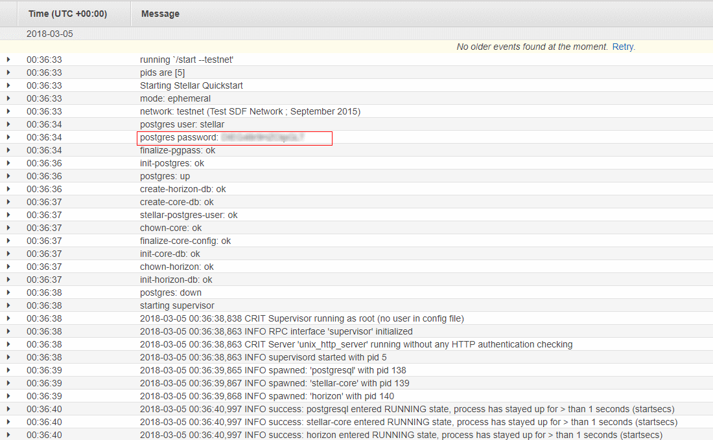

# NebulaForge minimal-ephemeral

This [CloudFormation](https://aws.amazon.com/cloudformation/) template deploys the [stellar/quickstart](https://github.com/stellar/docker-stellar-core-horizon) 
docker image running in a non-validating, ephemeral configuration connected to the test network. The deployment uses
a single VPC subnet in a single availability zone.

Stellar-core, Horizon and PostgreSQL are all running in the same container on the same EC2 instance. [AWS ECS](https://docs.aws.amazon.com/AmazonECS/latest/developerguide/Welcome.html)
is used to manage the container, and EC2 Autoscaling will replace the instance if it crashes or is terminated, but 
there is never more than one instance running at a time.

## Cost
The template creates a number of resources but the majority of them do not attract charges. You *will* be billed for 
the following resources:
 - [A single EC2 instance](https://aws.amazon.com/ec2/pricing/on-demand/)
 - [Data transfer](https://aws.amazon.com/ec2/pricing/on-demand/#Data_Transfer)

Any potential charges for data transfer will likely minimal or covered by the free teir.

**Disclaimer:** While we attempt to provide useful and up to date information, you are responsible for your own AWS 
account and the resources that you are charged for. Always be vigilant about doubling checking to ensure that the 
resources used are what your expect.

## Prerequisites
Aside from having an AWS account, the only prerequisite for deploying this template is that you have an EC2 key pair. 
The key pair allows you to SSH into your instance. If you don't already have a key pair you can [create one via the console](https://docs.aws.amazon.com/AWSEC2/latest/UserGuide/ec2-key-pairs.html#having-ec2-create-your-key-pair)
or upload an existing one.

## Launch
Click the links below to launch this configuration in the AWS region of your choice. If your desired region is
not listed, just copy one of the URLs and edit the region accordingly.

| AWS Region | Short name | | 
| -- | -- | -- |
| US East (N. Virginia) | us-east-1 | [Launch Stack :rocket:](https://console.aws.amazon.com/cloudformation/home?region=us-east-1#/stacks/new?stackName=stellar-minimal-ephemeral&templateURL=https://s3.amazonaws.com/public.starformlabs.io/nebulaforge/aws/minimal-ephemeral/master.yaml)
| US West (Oregon) | us-west-1 | [Launch Stack :rocket:](https://console.aws.amazon.com/cloudformation/home?region=us-west-1#/stacks/new?stackName=stellar-minimal-ephemeral&templateURL=https://s3.amazonaws.com/public.starformlabs.io/nebulaforge/aws/minimal-ephemeral/master.yaml)
| EU (Ireland) | eu-west-1 | [Launch Stack :rocket:](https://console.aws.amazon.com/cloudformation/home?region=eu-west-1#/stacks/new?stackName=stellar-minimal-ephemeral&templateURL=https://s3.amazonaws.com/public.starformlabs.io/nebulaforge/aws/minimal-ephemeral/master.yaml)
| EU (Frankfurt) | eu-central-1 | [Launch Stack :rocket:](https://console.aws.amazon.com/cloudformation/home?region=eu-central-1#/stacks/new?stackName=stellar-minimal-ephemeral&templateURL=https://s3.amazonaws.com/public.starformlabs.io/nebulaforge/aws/minimal-ephemeral/master.yaml)
| Asia Pacific (Tokyo) | ap-northeast-1 | [Launch Stack :rocket:](https://console.aws.amazon.com/cloudformation/home?region=ap-northeast-1#/stacks/new?stackName=stellar-minimal-ephemeral&templateURL=https://s3.amazonaws.com/public.starformlabs.io/nebulaforge/aws/minimal-ephemeral/master.yaml)
| Asia Pacific (Mumbai) | ap-south-1 | [Launch Stack :rocket:](https://console.aws.amazon.com/cloudformation/home?region=ap-south-1#/stacks/new?stackName=stellar-minimal-ephemeral&templateURL=https://s3.amazonaws.com/public.starformlabs.io/nebulaforge/aws/minimal-ephemeral/master.yaml) 
 

## Template
The template URL is a part of the launch link, so will be auto-selected by default. You don't need to change anything
on this screen. [Click here to view the template](https://s3.amazonaws.com/public.starformlabs.io/nebulaforge/aws/minimal-ephemeral/master.yaml)
directly, it never hurts to double check what you are deploying to your account!

 

## Set Parameters
Most of the default parameters can be left as is, however you must specify:
- An SSH Key Pair to be associated with the instance (choose from the dropdown).
- An IP address range that is allowed to SSH into the instance in [CIDR](https://en.wikipedia.org/wiki/Classless_Inter-Domain_Routing)
format.
- (Optional) An IP address range that is allowed to access the Horizon API via HTTP. Leave blank to block external access.

**NOTE: To restrict access to your current IP [Find your IP](https://www.google.com/search?q=ip) and then add /32 to the end.**

 
 

## Options and Review
You can **skip the options screen** entirely. On the review screen you can double check the parameters that you set.
If you click the link for AWS Cost Explorer you can get an *estimate* of the monthly costs of running the resources to be
deployed.

 
 

Be sure to select the acknowledgement at the end. It is basically confirming that you know that the template is
creating and IAM Role. Click the "Learn more" link in the warning box if you don't understand what that means.

 
 

## In Progress

It will take about 5 minutes for everything to be deloyed. You will see the resources being created in the events tab

 
 

## Create Complete

Once the deployment is done the status will be CREATE_COMPLETE. Switch to the **Outputs** tab to see the relevant URLs
- The SSH URL shows the IP of the server and the username. Authentication is done using the key pair specified
earlier.
- The Horizon URL is a direct link to the Horizon API.
- The Log Group URL will be used to find the PostgreSQL password.

 
 

## Finding the PostgreSQL password

When you click on the Log Group URL you will be taken to a screen showing a randomly named log file, click on it.

From there you will see the log details including the PostgreSQL password

 
 

## Final Notes

1. Horizon is only accessible over HTTP, not HTTPS.

1. The PostgreSQL port is not exposed to the internet. You must SSH into the server (or tunnel over SSH) to access the database.

1. The IP address output at the end is static, if the instance gets replaced for some reason you will need go to the 
[EC2 Console](https://console.aws.amazon.com/ec2/v2/home#Instances:sort=instanceId) to find the new address.

1. Please remember to report issues specific to the [docker image](https://github.com/stellar/docker-stellar-core-horizon/issues),
[stellar-core](https://github.com/stellar/stellar-core/issues), [Horizon](https://github.com/stellar/go/issues), etc 
to the appropriate repo and only report issues related to the CloudFormation template [here](https://github.com/starformlabs/stellar-nebulaforge-aws/issues). 
