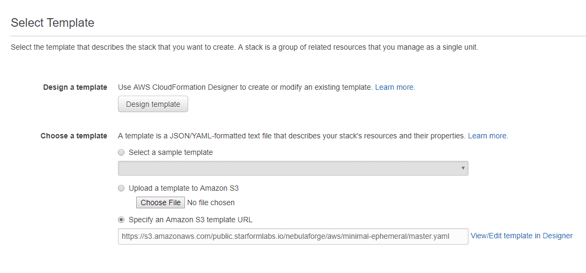
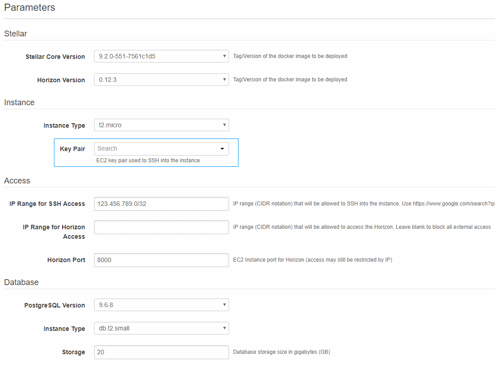
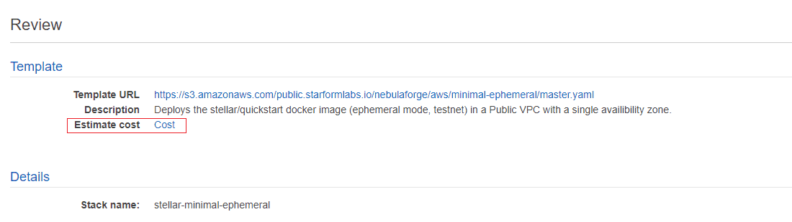
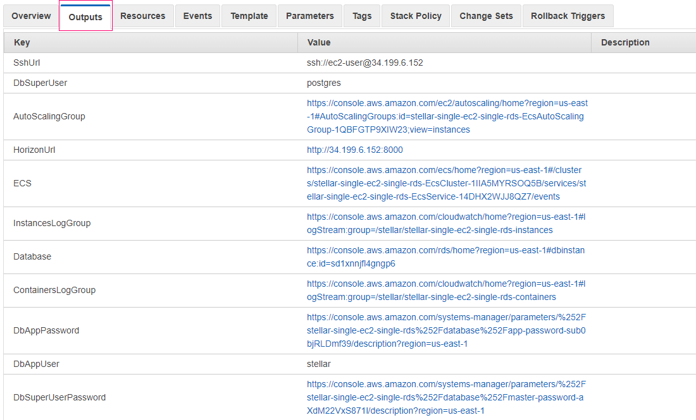
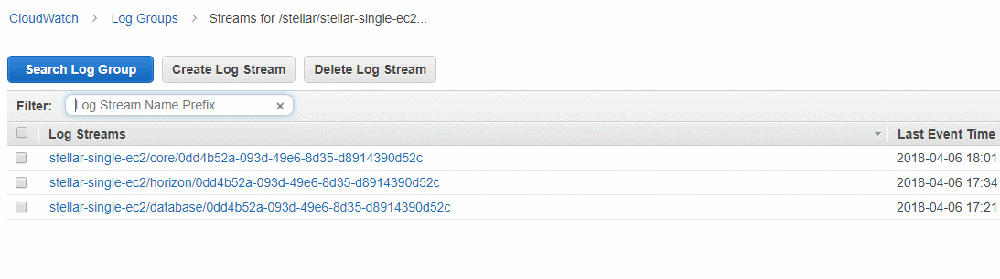
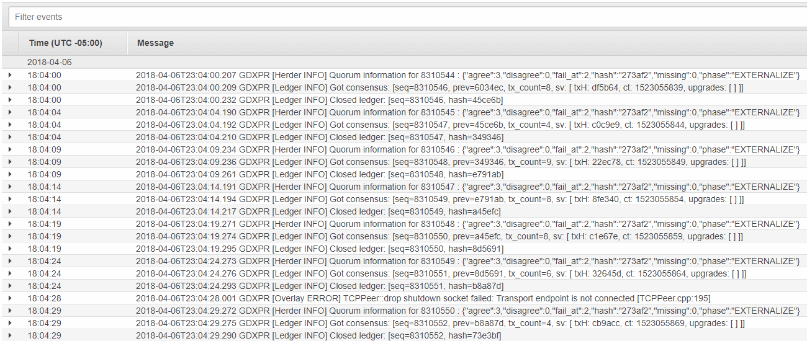

# SINGLE-EC2-SINGLE-RDS

This [CloudFormation](https://aws.amazon.com/cloudformation/) template deploys a [pair of docker images](https://github.com/starformlabs/stellar-nebulaforge-aws/tree/master/docker-images) 
running in a non-validating configuration connected to the test network. The deployment uses
a VPC with one public subnet and two private subnets.

Stellar-core and Horizon are all running in separate containers on the same EC2 instance. [AWS ECS](https://docs.aws.amazon.com/AmazonECS/latest/developerguide/Welcome.html)
is used to manage the container, and EC2 Autoscaling will replace the instance if it crashes or is terminated, but 
there is never more than one instance running at a time. **[RDS](https://aws.amazon.com/rds/postgresql/)** is being used to manage the database
and an **[EFS](https://aws.amazon.com/efs/)** backed volume is being used to store [local state](https://www.stellar.org/developers/stellar-core/software/admin.html#database-and-local-state). 

## Prerequisites
Aside from having an AWS account, the only prerequisite for deploying this template is that you have an EC2 key pair. 
The key pair allows you to SSH into your instance. If you don't already have a key pair you can [create one via the console](https://docs.aws.amazon.com/AWSEC2/latest/UserGuide/ec2-key-pairs.html#having-ec2-create-your-key-pair)
or upload an existing one.

## Launch
Click the links below to launch this stack in the AWS region of your choice. If your desired region is
not listed, just copy one of the URLs and edit the region accordingly.

| AWS Region | Short name | | 
| -- | -- | -- |
| US East (N. Virginia) | us-east-1 | [Launch Stack :rocket:](https://console.aws.amazon.com/cloudformation/home?region=us-east-1#/stacks/new?stackName=stellar-single-ec2-single-rds&templateURL=https://s3.amazonaws.com/public.starformlabs.io/nebulaforge/aws/single-ec2-single-rds/master.yaml)
| US East (Ohio) | us-east-2 | [Launch Stack :rocket:](https://console.aws.amazon.com/cloudformation/home?region=us-east-2#/stacks/new?stackName=stellar-single-ec2-single-rds&templateURL=https://s3.amazonaws.com/public.starformlabs.io/nebulaforge/aws/single-ec2-single-rds/master.yaml)
| US West (N. California) | us-west-1 | [Launch Stack :rocket:](https://console.aws.amazon.com/cloudformation/home?region=us-west-1#/stacks/new?stackName=stellar-single-ec2-single-rds&templateURL=https://s3.amazonaws.com/public.starformlabs.io/nebulaforge/aws/single-ec2-single-rds/master.yaml)
| US West (Oregon) | us-west-2 | [Launch Stack :rocket:](https://console.aws.amazon.com/cloudformation/home?region=us-west-2#/stacks/new?stackName=stellar-single-ec2-single-rds&templateURL=https://s3.amazonaws.com/public.starformlabs.io/nebulaforge/aws/single-ec2-single-rds/master.yaml)
| EU (Ireland) | eu-west-1 | [Launch Stack :rocket:](https://console.aws.amazon.com/cloudformation/home?region=eu-west-1#/stacks/new?stackName=stellar-single-ec2-single-rds&templateURL=https://s3.amazonaws.com/public.starformlabs.io/nebulaforge/aws/single-ec2-single-rds/master.yaml)
| EU (London) | eu-west-2 | [Launch Stack :rocket:](https://console.aws.amazon.com/cloudformation/home?region=eu-west-2#/stacks/new?stackName=stellar-single-ec2-single-rds&templateURL=https://s3.amazonaws.com/public.starformlabs.io/nebulaforge/aws/single-ec2-single-rds/master.yaml)
| EU (Frankfurt) | eu-central-1 | [Launch Stack :rocket:](https://console.aws.amazon.com/cloudformation/home?region=eu-central-1#/stacks/new?stackName=stellar-single-ec2-single-rds&templateURL=https://s3.amazonaws.com/public.starformlabs.io/nebulaforge/aws/single-ec2-single-rds/master.yaml)
| Asia Pacific (Tokyo) | ap-northeast-1 | [Launch Stack :rocket:](https://console.aws.amazon.com/cloudformation/home?region=ap-northeast-1#/stacks/new?stackName=stellar-single-ec2-single-rds&templateURL=https://s3.amazonaws.com/public.starformlabs.io/nebulaforge/aws/single-ec2-single-rds/master.yaml)
| Asia Pacific (Mumbai) | ap-south-1 | [Launch Stack :rocket:](https://console.aws.amazon.com/cloudformation/home?region=ap-south-1#/stacks/new?stackName=stellar-single-ec2-single-rds&templateURL=https://s3.amazonaws.com/public.starformlabs.io/nebulaforge/aws/single-ec2-single-rds/master.yaml)

## Cost
The template creates a number of resources but the majority of them do not attract charges. You *will* be billed for 
the following resources:
 - [A single EC2 instance](https://aws.amazon.com/ec2/pricing/on-demand/)
 - [30GB of EBS gp2 storage](https://aws.amazon.com/ebs/pricing/)
 - [A single RDS instance w/ 20GB of storage](https://aws.amazon.com/rds/postgresql/pricing/)
 - [1GB of EFS data usage](https://aws.amazon.com/efs/pricing/)
 - [Data Transfer](https://aws.amazon.com/ec2/pricing/on-demand/#Data_Transfer)

### Pay as you go
AWS Instances and EBS volumes are now billed per second (1 minute minimum) so you can run your instance for as
long or little as you like. **Estimated** monthly and daily prices for entry level instances are below.

#### t2.nano/db.t2.micro  (cheapest)
 - EC2 Instance - $4.25
 - EBS Storage - $3.00
 - RDS Instance - $13.20
 - RDS Storage - $2.30
 - EFS - $0.30
 - Data Transfer - $0.50
 - Total: **$23.55**/month | **$0.79**/day
 
#### t2.micro/db.t2.micro (default)
 - EC2 Instance - $8.50
 - EBS Storage - $3.00
 - RDS Instance - $13.20
 - RDS Storage - $2.30
 - EFS - $0.30
 - Data Transfer - $0.50
 - Total: **$27.80**/month | **$0.93**/day

### Free Tier
New AWS accounts are usually eligible for a [12 month free tier benefit](https://aws.amazon.com/free/?awsf.default=categories%2312monthsfree).
If you are still eligible for the free tier and use the t2.micro instance type, your only cost will be bandwidth. Note
that **t2.nano** instances are **NOT eligible for the free tier**.

##### t2.micro/db.t2.micro with 12 month Free Tier
 - EC2 Instance - $0.00
 - EBS Storage - $0.00
 - RDS Instance - $0.00
 - RDS Storage - $0.00
 - EFS - $0.00
 - Data Transfer - $0.50
 - Total: **$0.50**/month | **$0.02**/day

#### Data Transfer
Data Transfer pricing on AWS can be complex and usage patterns will vary from user to user. **$0.50 per month is a baseline
estimate** for SCP traffic and basic interaction with horizon. If you plan to do high volume testing or make your
horizon instance public be sure to keep an eye on the Data Transfer section of your bill.

#### CloudWatch
CloudWatch logging can also potentially attract charges, but it has a *permanent* free tier of 5GB ingested before
charges apply. A full month of logs including consensus details on the test network is estimated to be less
than 0.5GB of data.

#### Disclaimer
While we attempt to provide useful and up to date information, you are responsible for your own AWS 
account and the resources that you are charged for. Always be vigilant about doubling checking to ensure that the 
resources used are what your expect.
 
 

## Template
The template URL is a part of the launch link, so will be auto-selected by default. You don't need to change anything
on this screen. [Click here to view the template](https://s3.amazonaws.com/public.starformlabs.io/nebulaforge/aws/single-ec2-single-rds/master.yaml)
directly, it never hurts to double check what you are deploying to your account!

 

## Set Parameters
Most of the default parameters can be left as is, however you must specify:
- An SSH Key Pair to be associated with the instance (choose from the dropdown).
- An IP address range that is allowed to SSH into the instance in [CIDR](https://en.wikipedia.org/wiki/Classless_Inter-Domain_Routing)
format.
- (Optional) An IP address range that is allowed to access the Horizon API via HTTP. Leave blank to block external access.

**NOTE: To restrict access to your current IP [Find your IP](https://www.google.com/search?q=ip) and then add /32 to the end.**

 
 

## Options and Review
You can **skip the options screen** entirely. On the review screen you can double check the parameters that you set.
If you click the link for AWS Cost Explorer you can get an *estimate* of the monthly costs of running the resources to be
deployed.

 
 

Be sure to select the acknowledgement at the end. It is basically confirming that you know that the template is
creating and IAM Role. Click the "Learn more" link in the warning box if you don't understand what that means.

 
 

## In Progress

It will take about 5 minutes for everything to be deloyed. You will see the resources being created in the events tab

 
 

## Create Complete

Once the deployment is done the status will be CREATE_COMPLETE. Switch to the **Outputs** tab to see the relevant URLs
- The SSH URL shows the IP of the server and the username. Authentication is done using the key pair specified earlier.
- The Horizon URL is a direct link to the Horizon API.
- The ContainersLogGroup link will take you to a CloudWatch page with separate log streams for core, horizon and postgres.
- The ECS link will show you information about the state of the cluster.
- The DbAppUser value and DbSuperUserPassword link to the Parameter Store (Theses are the credentials used by stellar-core and horizon)
- The DbSuperUser value and DbSuperUserPassword link to the Parameter Store.

 
 

## Finding the PostgreSQL passwords

If you need database access, the PostgreSQL passwords are auto-generated by the template and stored securely in the 
SSM Parameter Store. Click on the relevant link in the output tab to be taken to that page then click the link to 
**Show** the value.

## Viewing log output

This template allows you to view the detailed logs generated by Stellar Core and Horizon without SSHing into your instance.
If you click on the **ContainersLogGroup** link in the outputs tab it will take to a page that links to the log streams
for core, horizon and the database.

 
 

Clicking on those links will show you more detailed logs for each system including consensus logging for core.

 
 

## Final Notes

1. Horizon is only accessible over HTTP, not HTTPS.

1. The PostgreSQL port is not exposed to the internet. You must SSH into the server (or tunnel over SSH) to access the database.

1. Please remember to report issues specific to the [docker image](https://github.com/stellar/docker-stellar-core-horizon/issues),
[stellar-core](https://github.com/stellar/stellar-core/issues), [horizon](https://github.com/stellar/go/issues), etc 
to the appropriate repo and only report issues related to the CloudFormation template [here](https://github.com/starformlabs/stellar-nebulaforge-aws/issues). 
